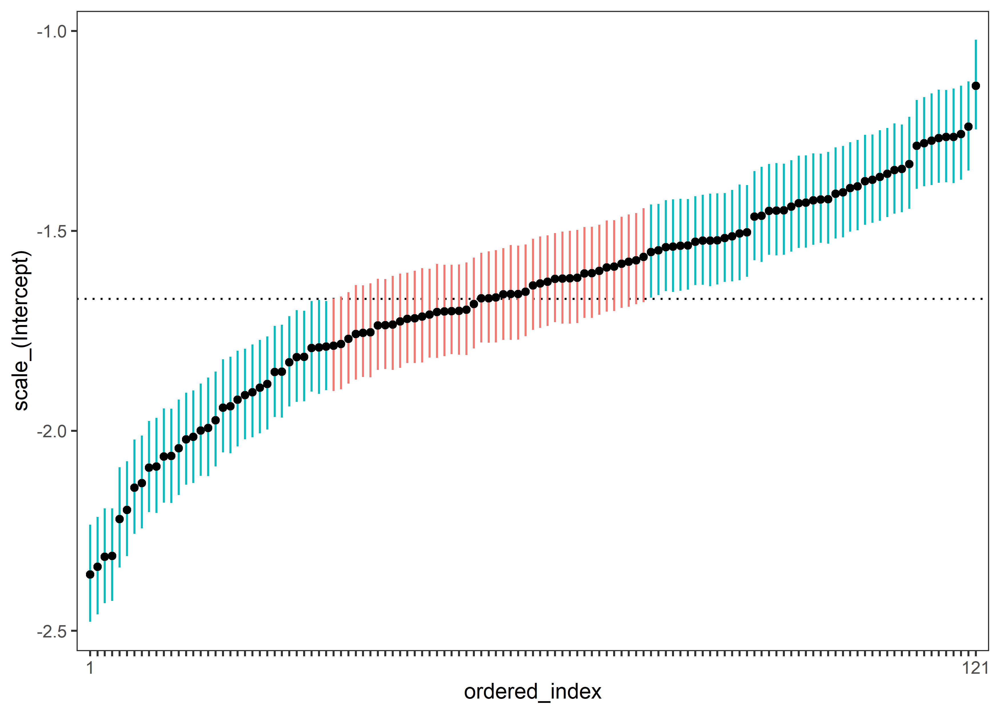

hypMuVar: Bayesian Hypothesis <br/> Testing of Mean-Variance Relations
======================================================================

Overview
--------

This is a dedicated R package for testing mean-variance relations. Currently the methodology is for Bayesian mixed-effects *location scale* models (MELSM, mel⋅zem; Hedeker, Mermelstein, and Demirtas 2008), where mean and (within-person) variance relations are tested in the distribution of random effects. This is accomplished with *covariance* selection, in which the random effects correlations are tested with a mixture of prior distributions. In future releases, this package will allow for testing other mean-variance relations, including linear models (no random effects) and fixed effects in the MELSM.

### Who actually studies mean-variance relations ?

Across the sciences, there is large literature investigating mean-variance relations (e.g., Nakagawa et al. 2015; Xiao, Locey, and White 2015; Moreno et al. 2003). The typical pattern is that means are positively correlated with variances (or standard deviations)[1]. As one example, in ecology the relationship between the mean and variance of species abundance is known as [Taylor's law](https://en.wikipedia.org/wiki/Taylor%27s_law). That Wikipedia page in particular includes interesting references that date back to the 1920's (e.g., Jerzy Neyman studied the mean-variance relation in 1926). Furthermore, a related line of research has set out to identify processes that violate the "law" (e.g., Pratte et al. 2010; Schwarz and Miller 2012).

In my field (psychology), there is also a rich (perhaps the richest!) tradition of studying mean-variance relations. The most prominent example comes from cognitive psychology, where a *lawful*, linear relation between reaction time means and standard deviations was proposed in Wagenmakers and Brown (2007). Accordingly, we demonstrated the utility of our methodology in cognitive inhibition tasks (see Williams, Rouder, and Rast 2019).

### Is hypMuVar necessary ?

**hypMuVar** is not meant to be a general package for mixed-effects modeling (see here [brms](https://github.com/paul-buerkner/brms)). There is certainly a need for **hypMuVar**, however, because the testing strategy is not possible with current software. I anticipate this package will be most useful for researchers specifically interested in testing (possibly confirmatory) hypotheses about the mean-variance relation or the (within-person) variance structure in general (in future releases). This extends inference beyond the customary goal (of testing mean differences) and thus opens the door for answering novel research questions.

Installation
------------

Note you will also have to intall jags (see here [download page](https://sourceforge.net/projects/mcmc-jags/))

``` r
# install.packages("devtools")
devtools::install_github("donaldRwilliams/hypMuVar")
```

``` r
library(hypMuVar)
library(ggplot2)
```

Random intercepts for the location and scale
--------------------------------------------

This model effectively estimates the reaction time means and variances (on the log scale) for each person. These are hierarchical estimates, which provides shrinkage that can improve accuracy. Note a customary, location only, mixed effects model assumes that each person shares a common variance. This is implemented with

``` r
fit_int <- melsm(fixed_location = rt ~ 1, 
                 random_location = ~ 1| ID, 
                 fixed_scale = sigma ~ 1, 
                 random_scale = ~ 1 | ID, k = 3, 
                 mixture = "SSVS", adapt = 5000, 
                 iter = 10000, 
                 rho_test = "muvar",
                 data = stroop)
```

Note `mixture = "SSVS"` corresponds to stochastic search variable selection (George and McCulloch 1993). This is a "spike" and slab approach that utilizes a mixture of prior distributions (see here for reviews O’Hara and Sillanpää 2009; Malsiner-Walli and Wagner 2011). In the case of SSVS, there are typically two normal distributions, with the "spike" concentrated around zero. One innovation of **hypMuVar** is to extend that approach to several mixture components. `k = 3` specifies a prior comprised of three distributions that place restrictions to positive values (k = 2), negative values (k = 3), or a null region (k = 1). Setting `k = 2` is also an option, as well as the Dirac spike and slab formulation (T. J. Mitchell and Beauchamp 1988; Kuo and Mallick 1998).

``` r
summary(fit_int)
#> hypMuVar: Bayesian Hypothesis Testing 
#>           of Mean--Variance Relations
#> Model: MELSM
#> Chains: 4 
#> Samples: 40000 
#> Mixture: SSVS 
#> Rho Test: muvar 
#> Credible Interval: 0.95 
#> ----
#> Call:
#> melsm.default(fixed_location = rt ~ 1, random_location = ~1 | 
#>     ID, fixed_scale = sigma ~ 1, random_scale = ~1 | ID, mixture = "SSVS", 
#>     k = 3, adapt = 5000, iter = 10000, data = stroop)
#> ----
#> 
#> Random Effects Correlations
#> Posterior Distirbutions
#>                                                 Post.mean Post.sd Cred.lb Cred.ub
#>  rho_01: location_(Intercept)_scale_(Intercept) 0.642     0.058   0.518   0.744  
#> 
#> Inclusion Probabilities
#>                                                 Pr.k1 Pr.k2 Pr.k3
#>  rho_01: location_(Intercept)_scale_(Intercept) 0     1     0    
#> 
#> ----
#> 
#> Random Effects Standard Deviations
#>                              Post.mean Post.sd Cred.lb Cred.ub
#>  tau_0: location_(Intercept) 0.097     0.006   0.085   0.111  
#>  tau_1: scale_(Intercept)    0.272     0.019   0.238   0.311  
#> 
#> ----
#> 
#> Fixed Effects
#>                               Post.mean Post.sd Cred.lb Cred.ub
#>  beta_0: location_(Intercept)  0.739    0.009    0.721   0.757 
#>  eta_0:  scale_(Intercept)    -1.670    0.027   -1.723  -1.617 
#> 
#> ----
#> note 
#> k1: 'spike' 
#> k2: positive slab 
#> k3: negative slab
```

As seen in the summary output, component number 2 has an inclusion probability of 1. This results in an infinite Bayes factor in favor of a positive relation. Furthermore, it is possible to test all random effects correlations by setting `rho_test = "all"`. This would employ the chosen mixture approach for all off-diagonal elements in the random effects covariance matrix.

The individual-specific effects can also be visualized in a variety of ways. For example,

``` r
# coefficients
coefs <- coef(fit_int, cred = 0.90)
plot(coefs)[[2]] +
   theme_bw() +
   theme(panel.grid = element_blank(), 
         legend.position = "none") +
   scale_x_discrete(labels = c(1, rep("", 119), 121),
                   expand = c(0.015, 0.015)) 
```



plots the reaction time standard deviations for each person. These are on the log scale. Note that, in a location only mixed effects model, it is assumed that each person is adequately represented by the dotted line. In these data, there is clearly heterogeneous within-person variance.

Further, it is also possible to visualize the relations between the individual-specific effects. Testing these mean-relations in the distribution of random effects is the primary objective in Williams, Rouder, and Rast (2019).

``` r
cor_plot(fit_int)[[1]]
```


Random slopes for the location and scale:
-----------------------------------------

``` r
fit <- melsm(fixed_location = rt ~  congruency,
             random_location = ~  congruency | ID,
             fixed_scale = sigma ~  congruency,
             random_scale = ~ congruency | ID,  
             mixture = "SSVS", k = 3,
             adapt = 5000, 
             iter = 10000, 
             data = stroop)
```

``` r
summary(fit)
#> hypMuVar: Bayesian Hypothesis Testing 
#>           of Mean--Variance Relations
#> Model: MELSM
#> Chains: 4 
#> Samples: 40000 
#> Mixture: SSVS 
#> Rho Test: muvar 
#> Credible Interval: 0.95 
#> ----
#> Call:
#> melsm.default(fixed_location = rt ~ congruency, random_location = ~congruency | 
#>     ID, fixed_scale = sigma ~ congruency, random_scale = ~congruency | 
#>     ID, mixture = "SSVS", k = 3, adapt = 5000, iter = 10000, 
#>     data = stroop)
#> ----
#> 
#> Random Effects Correlations
#> Posterior Distirbutions
#>                                                                     Post.mean Post.sd Cred.lb Cred.ub
#>  rho_01: location_(Intercept)_location_congruencyincongruent        -0.270    0.147   -0.557   0.014 
#>  rho_02: location_(Intercept)_scale_(Intercept)                      0.655    0.060    0.522   0.757 
#>  rho_03: location_(Intercept)_scale_congruencyincongruent           -0.365    0.105   -0.534  -0.131 
#>  rho_12: location_congruencyincongruent_scale_(Intercept)           -0.050    0.109   -0.317   0.131 
#>  rho_13: location_congruencyincongruent_scale_congruencyincongruent  0.735    0.082    0.536   0.858 
#>  rho_23: scale_(Intercept)_scale_congruencyincongruent              -0.564    0.076   -0.687  -0.400 
#> 
#> Inclusion Probabilities
#>                                                                     Pr.k1 Pr.k2 Pr.k3
#>  rho_01: location_(Intercept)_location_congruencyincongruent                         
#>  rho_02: location_(Intercept)_scale_(Intercept)                     0     1     0    
#>  rho_03: location_(Intercept)_scale_congruencyincongruent           0.018 0     0.982
#>  rho_12: location_congruencyincongruent_scale_(Intercept)           0.49  0.125 0.385
#>  rho_13: location_congruencyincongruent_scale_congruencyincongruent 0     1     0    
#>  rho_23: scale_(Intercept)_scale_congruencyincongruent                               
#> 
#> ----
#> 
#> Random Effects Standard Deviations
#>                                        Post.mean Post.sd Cred.lb Cred.ub
#>  tau_0: location_(Intercept)           0.100     0.007   0.087   0.113  
#>  tau_1: location_congruencyincongruent 0.027     0.004   0.018   0.036  
#>  tau_2: scale_(Intercept)              0.342     0.024   0.297   0.391  
#>  tau_3: scale_congruencyincongruent    0.234     0.020   0.196   0.276  
#> 
#> ----
#> 
#> Fixed Effects
#>                                         Post.mean Post.sd Cred.lb Cred.ub
#>  beta_0: location_(Intercept)            0.707    0.009    0.687   0.725 
#>  beta_1: location_congruencyincongruent  0.067    0.004    0.058   0.075 
#>  eta_0:  scale_(Intercept)              -1.784    0.033   -1.853  -1.724 
#>  eta_1:  scale_congruencyincongruent     0.155    0.026    0.103   0.205 
#> 
#> ----
#> note 
#> k1: 'spike' 
#> k2: positive slab 
#> k3: negative slab
```

### Marginal Bayes Factors

k2 (positive component) vs. the compliment

``` r
bf <- marginal_bf(fit, H1 = "k2")

bf
#> hypMuVar: Bayesian Hypothesis Testing 
#>           of Mean--Variance Relations
#> Model: MELSM
#> Mixture: SSVS 
#> Rho Test: muvar 
#> Hypotheses
#> H1: rho = k2 
#> H2: rho = compliment 
#> -----
#>  Correlation                                                        BF_12
#>  rho_01: location_(Intercept)_location_congruencyincongruent           NA
#>  rho_02: location_(Intercept)_scale_(Intercept)                       Inf
#>  rho_03: location_(Intercept)_scale_congruencyincongruent           0.000
#>  rho_12: location_congruencyincongruent_scale_(Intercept)           0.286
#>  rho_13: location_congruencyincongruent_scale_congruencyincongruent   Inf
#>  rho_23: scale_(Intercept)_scale_congruencyincongruent                 NA
```

k2 (positive component) vs. k1(null component)

``` r
# note testing against the compliment is preferable
bf <- marginal_bf(fit, H1 = "k2", H2 = "k1")

bf
#> hypMuVar: Bayesian Hypothesis Testing 
#>           of Mean--Variance Relations
#> Model: MELSM
#> Mixture: SSVS 
#> Rho Test: muvar 
#> Hypotheses
#> H1: rho = k2 
#> H2: rho = k1 
#> -----
#>  Correlation                                                        BF_12
#>  rho_01: location_(Intercept)_location_congruencyincongruent           NA
#>  rho_02: location_(Intercept)_scale_(Intercept)                       Inf
#>  rho_03: location_(Intercept)_scale_congruencyincongruent           0.000
#>  rho_12: location_congruencyincongruent_scale_(Intercept)           0.255
#>  rho_13: location_congruencyincongruent_scale_congruencyincongruent   Inf
#>  rho_23: scale_(Intercept)_scale_congruencyincongruent                 NA
```

### Posterior Model Probabilities

``` r
prob <- model_prob(fit)

prob
#> hypMuVar: Bayesian Hypothesis Testing 
#>           of Mean--Variance Relations
#> Model: MELSM
#> Mixture: SSVS 
#> Rho Test: muvar 
#> Components: 3 
#> ----
#> 
#>         Post.prob    BF.1i rho_02 rho_03 rho_12 rho_13
#> Model 1     0.482    1.000      2      3      1      2
#> Model 2     0.381    1.265      2      3      3      2
#> Model 3     0.119    4.051      2      3      2      2
#> Model 4     0.008   59.481      2      1      1      2
#> Model 5     0.006   85.274      2      1      2      2
#> Model 6     0.004  118.233      2      1      3      2
#> Model 7     0.000 2753.143      2      2      3      2
#> Model 8     0.000 3212.000      2      2      1      2
#> Model 9     0.000 3854.400      2      2      2      2
#> ----
#> 
#> rho_02: location_(Intercept)_scale_(Intercept)
#> rho_03: location_(Intercept)_scale_congruencyincongruent
#> rho_12: location_congruencyincongruent_scale_(Intercept)
#> rho_13: location_congruencyincongruent_scale_congruencyincongruent
```

### Confirmatory Hypothesis Testing

``` r
hyp <- list(h1 = c("rho_02 = k2", 
                   "rho_03 = k2", 
                   "rho_12 = k2", 
                   "rho_13 = k2"))

confirm(fit, hyp = hyp)
#> hypMuVar: Bayesian Hypothesis Testing 
#>           of Mean--Variance Relations
#> Model: MELSM
#> Mixture: SSVS 
#> ----
#> Hypotheses
#> H1: rho_02 = k2 rho_03 = k2 rho_12 = k2 rho_13 = k2 
#> H2: compliment
#> 
#> BF_12 = 0.01 
#> ----
#>  Hyp Post.prob Prior.Prob
#>   H1         0      0.012
#>   H2         1      0.988
```

#### References

George, E I, and R E McCulloch. 1993. “Variable selection via Gibbs sampling.” *Journal of the American Statistical Association* 88 (August 2015): 881–89. doi:[10.1080/01621459.1993.10476353](https://doi.org/10.1080/01621459.1993.10476353).

Hedeker, Donald, Robin J. Mermelstein, and Hakan Demirtas. 2008. “An application of a mixed-effects location scale model for analysis of ecological momentary assessment (EMA) data.” *Biometrics* 64 (2): 627–34. doi:[10.1111/j.1541-0420.2007.00924.x](https://doi.org/10.1111/j.1541-0420.2007.00924.x).

Kuo, Lynn, and Bani Mallick. 1998. “Variable Selection for Regression Models.” *Sankhyā: The Indian Journal of Statistics, Series B* 60 (1): 65–81.

Malsiner-Walli, Gertraud, and Helga Wagner. 2011. “Comparing Spike and Slab Priors for Bayesian Variable Selection.” *Austrian Journal of Statistics* 40 (4): 241–64.

Mitchell, David J, Benjamin G Fanson, Christa Beckmann, and Peter A Biro. 2016. “Towards Powerful Experimental and Statistical Approaches to Study Intraindividual Variability in Labile Traits.” *Royal Society Open Science* 3 (10). The Royal Society: 160352.

Mitchell, T J, and J J Beauchamp. 1988. “Bayesian variable selection in linear regression (with discussion).” *J. Amer. Statist. Assoc.* 83 (1988): 1023–36.

Moreno, Juan, Vicente Polo, Juan J Sanz, Ana de León, Eduardo Mínguez, and José P Veiga. 2003. “The Relationship Between Population Means and Variances in Reproductive Success: Implications of Life History and Ecology.” *Evolutionary Ecology Research* 5 (8). Evolutionary Ecology, Ltd.: 1223–37.

Nakagawa, Shinichi, Robert Poulin, Kerrie Mengersen, Klaus Reinhold, Leif Engqvist, Malgorzata Lagisz, and Alistair M Senior. 2015. “Meta-Analysis of Variation: Ecological and Evolutionary Applications and Beyond.” *Methods in Ecology and Evolution* 6 (2). Wiley Online Library: 143–52.

O’Hara, R. B., and M. J. Sillanpää. 2009. “A review of bayesian variable selection methods: What, how and which.” *Bayesian Analysis* 4 (1): 85–118. doi:[10.1214/09-BA403](https://doi.org/10.1214/09-BA403).

Pratte, M. S., J. N. Rouder, R. D. Morey, and C. Feng. 2010. “Exploring the differences in distributional properties between Stroop and Simon effects using delta plots.” *Attention, Perception & Psychophysics* 72 (7). Springer-Verlag: 2013–25. doi:[10.3758/APP.72.7.2013](https://doi.org/10.3758/APP.72.7.2013).

Schwarz, Wolf, and Jeff Miller. 2012. “Response time models of delta plots with negative-going slopes.” *Psychonomic Bulletin & Review* 19 (4). Springer-Verlag: 555–74. doi:[10.3758/s13423-012-0254-6](https://doi.org/10.3758/s13423-012-0254-6).

Wagenmakers, Eric-Jan, and Scott Brown. 2007. “On the Linear Relation Between the Mean and the Standard Deviation of a Response Time Distribution.” *Psychological Review* 114 (3). American Psychological Association: 830.

Williams, Donald R, Jeffrey Rouder, and Philippe Rast. 2019. “Beneath the Surface: Unearthing Within-Person Variability and Mean Relations with Bayesian Mixed Models.” PsyArXiv.

Xiao, Xiao, Kenneth J Locey, and Ethan P White. 2015. “A Process-Independent Explanation for the General Form of Taylor’s Law.” *The American Naturalist* 186 (2). University of Chicago Press Chicago, IL: E51–E60.

[1] Interestingly, I recently came across a paper investigating the mean-variance relation in guppies (D. J. Mitchell et al. 2016). Apparently, in that field, the MELSM has been termed the *doubly hierarchical model* (see here [dhglm](https://rdrr.io/cran/dhglm/)).
